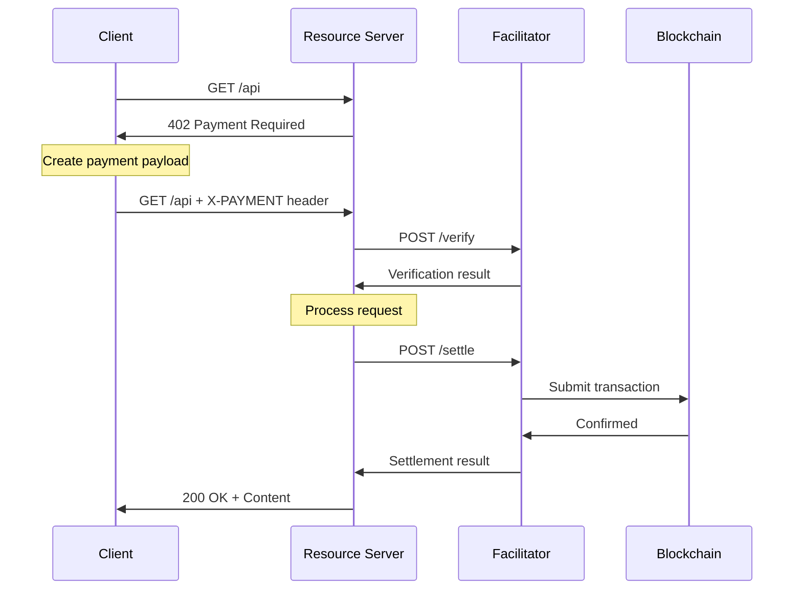

# t402

[](https://www.npmjs.com/package/@t402/core)
[](https://pypi.org/project/t402/)
[](https://pkg.go.dev/github.com/t402-io/t402/go)
[](https://central.sonatype.com/artifact/io.t402/t402)
[](LICENSE)

t402 is an open standard for internet native payments. It aims to support all networks (both crypto & fiat) and forms of value (stablecoins, tokens, fiat).

```typescript
app.use(
  paymentMiddleware(
    {
      "GET /weather": {
        accepts: [...],                 // As many networks / schemes as you want to support
        description: "Weather data",    // what your endpoint does
      },
    },
  ),
);
// That's it! See examples/ for full details
```

## Package Architecture

```
@t402/core              Core types, client, server, facilitator abstractions
@t402/extensions        Bazaar, Sign-In-With-X extensions

Mechanisms (Chain-specific payment implementations):
@t402/evm               EIP-3009, ERC-4337, USDT0 bridge for EVM chains
@t402/svm               Solana SPL token support
@t402/ton               TON Jetton (TEP-74) support
@t402/tron              TRON TRC-20 support

HTTP Integrations:
@t402/express           Express.js middleware
@t402/hono              Hono middleware
@t402/fastify           Fastify middleware
@t402/next              Next.js integration
@t402/fetch             Fetch API wrapper
@t402/axios             Axios interceptor
@t402/paywall           Payment wall UI components
@t402/react             React hooks and components
@t402/vue               Vue composables and components

WDK (Wallet Development Kit):
@t402/wdk               Tether WDK integration
@t402/wdk-gasless       ERC-4337 gasless payments
@t402/wdk-bridge        LayerZero cross-chain bridging
@t402/wdk-multisig      Safe multi-sig support

Tools:
@t402/mcp               AI Agent MCP server (Claude, etc.)
@t402/cli               Command-line tools
```

<details>
<summary><b>Installation</b></summary>

### TypeScript (v2.0.0+)

```shell
# Core packages
pnpm add @t402/core @t402/evm

# With specific framework
pnpm add @t402/express  # Express.js
pnpm add @t402/next     # Next.js
pnpm add @t402/hono     # Hono

# Gasless payments
pnpm add @t402/wdk-gasless

# MCP Server for AI Agents
pnpm add @t402/mcp
npx @t402/mcp  # Run directly

# CLI tool
pnpm add -g @t402/cli
t402 --help
```

### Python (v1.6.1)

```shell
pip install t402

# Or with uv
uv add t402

# CLI tool included
t402 --help
```

### Go (v1.5.0)

```shell
go get github.com/t402-io/t402/go@v1.5.0

# CLI tool
go install github.com/t402-io/t402/go/cmd/t402@v1.5.0
t402 --help
```

### Java (v1.1.0)

```xml
<dependency>
  <groupId>io.t402</groupId>
  <artifactId>t402</artifactId>
  <version>1.1.0</version>
</dependency>
```

Or with Gradle:

```groovy
implementation 'io.t402:t402:1.1.0'
```

</details>

<details>
<summary><b>Supported Networks</b></summary>

### EVM (Ethereum Virtual Machine)
- Ethereum Mainnet (`eip155:1`)
- Base (`eip155:8453`, `eip155:84532`)
- Arbitrum (`eip155:42161`)
- Optimism (`eip155:10`)
- Polygon (`eip155:137`)
- Supports USDC, USDT, USDT0, and native tokens

### ERC-4337 Account Abstraction
- **Gasless Transactions**: Users pay zero gas fees via paymaster sponsorship
- **Smart Accounts**: Safe 4337 Module v0.3.0 integration
- **Bundlers**: Pimlico, Alchemy, and generic bundler support
- **Paymasters**: Pimlico, Biconomy, Stackup integrations
- **EntryPoint v0.7**: Full support for latest ERC-4337 specification

### SVM (Solana Virtual Machine)
- Solana Mainnet (`solana:5eykt4UsFv8P8NJdTREpY1vzqKqZKvdp`)
- Solana Devnet (`solana:EtWTRABZaYq6iMfeYKouRu166VU2xqa1`)
- Supports USDC and native SOL

### TON (The Open Network)
- TON Mainnet (`ton:mainnet`)
- TON Testnet (`ton:testnet`)
- Supports USDT Jetton (TEP-74 standard)

### TRON
- TRON Mainnet (`tron:mainnet`)
- TRON Nile Testnet (`tron:nile`)
- TRON Shasta Testnet (`tron:shasta`)
- Supports USDT TRC-20 (TIP-20 standard)

### USDT0 Cross-Chain Bridge (LayerZero)
- **Supported chains**: Ethereum, Arbitrum, Ink, Berachain, Unichain
- **Message tracking** via LayerZero Scan API

</details>

## CLI Tools

All SDKs include CLI tools for payment operations.

```bash
# Verify a payment payload
t402 verify <base64-payload>

# Settle a payment
t402 settle <base64-payload>

# List supported networks
t402 supported

# Encode/decode payloads
t402 encode payment.json
t402 decode <base64-string>

# Network information
t402 info eip155:8453
```

**Available in**: TypeScript (`@t402/cli`), Python (`pip install t402`), Go (`go install .../cmd/t402`)

## Principles

- **Open standard:** the t402 protocol will never force reliance on a single party
- **HTTP Native:** t402 is meant to seamlessly complement the existing HTTP request made by traditional web services
- **Chain and token agnostic:** we welcome contributions that add support for new chains, signing standards, or schemes
- **Trust minimizing:** all payment schemes must not allow for the facilitator or resource server to move funds, other than in accordance with client intentions
- **Easy to use:** t402 needs to be 10x better than existing ways to pay on the internet

## SDK Feature Matrix

| Feature | TypeScript | Go | Python | Java |
|---------|-----------|-----|--------|------|
| Core Client | ✅ | ✅ | ✅ | ✅ |
| Core Server | ✅ | ✅ | ✅ | ✅ |
| Facilitator | ✅ | ✅ | ✅ | ✅ |
| EVM Mechanism | ✅ | ✅ | ✅ | ✅ |
| SVM Mechanism | ✅ | ✅ | ✅ | ✅ |
| TON Mechanism | ✅ | ✅ | ✅ | ✅ |
| TRON Mechanism | ✅ | ✅ | ✅ | ✅ |
| ERC-4337 | ✅ | ✅ | ✅ | ✅ |
| USDT0 Bridge | ✅ | ✅ | ✅ | ✅ |
| WDK Integration | ✅ | ✅ | ✅ | ✅ |
| MCP Server | ✅ | ✅ | ✅ | ❌ |
| CLI Tool | ✅ | ✅ | ✅ | ✅ |
| Spring Boot | ❌ | ❌ | ❌ | ⚠️ |

Legend: ✅ Complete | ⚠️ Partial | ❌ Not Available

## Latest Releases

| SDK | Version | Release Date | Changelog |
|-----|---------|--------------|-----------|
| TypeScript | v2.0.0 | 2026-01-16 | [CHANGELOG](typescript/CHANGELOG.md) |
| Python | v1.6.1 | 2026-01-16 | [CHANGELOG](python/CHANGELOG.md) |
| Go | v1.5.0 | 2026-01-16 | [CHANGELOG](go/CHANGELOG.md) |
| Java | v1.1.0 | 2026-01-16 | [CHANGELOG](java/CHANGELOG.md) |

## Ecosystem

The t402 ecosystem is growing! Check out our [ecosystem page](https://t402.io/ecosystem) to see projects building with t402.

**Roadmap:** see [ROADMAP.md](https://github.com/t402-io/t402/blob/main/ROADMAP.md)

## Terms

- `resource`: Something on the internet (webpage, API, RPC service, etc.)
- `client`: An entity wanting to pay for a resource
- `facilitator`: A server that facilitates verification and execution of payments
- `resource server`: An HTTP server that provides an API or resource for a client

## Typical t402 Flow



1. `Client` makes an HTTP request to a `resource server`
2. `Resource server` responds with `402 Payment Required` and `PaymentRequired` header
3. `Client` creates a `PaymentPayload` based on selected `scheme` & `network`
4. `Client` sends request with `PAYMENT-SIGNATURE` header
5. `Resource server` verifies via facilitator's `/verify` endpoint
6. `Facilitator` validates and returns verification response
7. If valid, server fulfills request and settles payment via `/settle`
8. `Resource server` returns `200 OK` with `PAYMENT-RESPONSE` header

## Quick Start Examples

<details>
<summary><b>TypeScript Client</b></summary>

```typescript
import { t402Client, wrapFetchWithPayment } from "@t402/fetch";
import { registerExactEvmScheme } from "@t402/evm/exact/client";
import { privateKeyToAccount } from "viem/accounts";

const client = new t402Client();

registerExactEvmScheme(client, {
  signer: privateKeyToAccount(process.env.PRIVATE_KEY as `0x${string}`),
});

const fetchWithPayment = wrapFetchWithPayment(fetch, client);
const response = await fetchWithPayment("https://api.example.com/data");
```

</details>

<details>
<summary><b>TypeScript Server (Express)</b></summary>

```typescript
import express from "express";
import { paymentMiddleware, t402ResourceServer } from "@t402/express";
import { ExactEvmScheme } from "@t402/evm/exact/server";

const app = express();

app.use(
  paymentMiddleware(
    {
      "GET /api/data": {
        accepts: [
          { scheme: "exact", price: "$0.01", network: "eip155:8453", payTo: "0x..." },
        ],
        description: "Premium API data",
      },
    },
    new t402ResourceServer(facilitatorClient)
      .register("eip155:8453", new ExactEvmScheme()),
  ),
);
```

</details>

<details>
<summary><b>Python Server (Flask)</b></summary>

```python
from flask import Flask
from t402.flask import create_paywall

app = Flask(__name__)

paywall = create_paywall(
    routes={
        "GET /api/data": {
            "price": "$0.01",
            "network": "eip155:8453",
            "pay_to": "0x...",
            "description": "Premium API data",
        },
    },
    facilitator_url="https://facilitator.t402.io",
)
app.register_blueprint(paywall)

@app.route("/api/data")
def get_data():
    return {"data": "premium content"}
```

</details>

<details>
<summary><b>Go Server</b></summary>

```go
package main

import (
    "net/http"
    t402 "github.com/t402-io/t402/go"
    t402http "github.com/t402-io/t402/go/http"
)

func main() {
    server := t402.NewResourceServer(facilitatorClient)

    mux := http.NewServeMux()
    mux.Handle("/api/data", t402http.PaymentMiddleware(
        server,
        t402http.RouteConfig{
            Path: "GET /api/data",
            Accepts: []t402.PaymentRequirement{
                {Scheme: "exact", Price: "$0.01", Network: "eip155:8453", PayTo: "0x..."},
            },
        },
        http.HandlerFunc(func(w http.ResponseWriter, r *http.Request) {
            w.Write([]byte(`{"data": "premium content"}`))
        }),
    ))

    http.ListenAndServe(":8080", mux)
}
```

</details>

<details>
<summary><b>ERC-4337 Gasless Payments</b></summary>

```typescript
import { SafeSmartAccount, createBundlerClient, createPaymaster } from "@t402/evm/erc4337";

// Create Safe smart account
const safeAccount = new SafeSmartAccount({
  owner: privateKeyToAccount(ownerPrivateKey),
  chainId: 8453,
});

// Connect bundler and paymaster
const bundler = createBundlerClient({ provider: "pimlico", apiKey, chainId: 8453 });
const paymaster = createPaymaster({ provider: "pimlico", apiKey, chainId: 8453 });

// Build, sponsor, and submit UserOperation
const callData = safeAccount.encodeExecute(targetAddress, 0n, data);
const userOp = await bundler.buildUserOperation({ sender: smartAccountAddress, callData });
const paymasterData = await paymaster.sponsorUserOperation(userOp);
const hash = await bundler.sendUserOperation({ ...userOp, ...paymasterData, signature });
```

</details>

<details>
<summary><b>MCP Server for AI Agents</b></summary>

```bash
# Install and run
npx @t402/mcp

# Claude Desktop config (~/.config/claude/claude_desktop_config.json)
{
  "mcpServers": {
    "t402": {
      "command": "npx",
      "args": ["@t402/mcp"],
      "env": { "T402_DEMO_MODE": "true" }
    }
  }
}
```

**Available Tools:**
- `t402/getBalance` - Check wallet balance
- `t402/getAllBalances` - Check all chain balances
- `t402/pay` - Execute payment
- `t402/payGasless` - Gasless payment via ERC-4337
- `t402/getBridgeFee` - Get bridge fee quote
- `t402/bridge` - Bridge USDT0 between chains

</details>

<details>
<summary><b>USDT0 Cross-Chain Bridge</b></summary>

```typescript
import { Usdt0Bridge, LayerZeroScanClient } from "@t402/evm";

const bridge = new Usdt0Bridge(signer, "arbitrum");

// Get quote
const quote = await bridge.quote({
  fromChain: "arbitrum",
  toChain: "ethereum",
  amount: 100_000000n,
  recipient: "0x...",
});

// Execute bridge
const result = await bridge.send({ ...quote });

// Track delivery
const scanClient = new LayerZeroScanClient();
await scanClient.waitForDelivery(result.messageGuid);
```

</details>

## Specification

See `specs/` for full documentation of the t402 standard.

### Schemes

A scheme is a logical way of moving money. Different schemes support different payment flows:
- `exact` - Transfer a specific amount (e.g., pay $1 to read an article)
- `upto` - Transfer up to an amount based on usage (e.g., LLM token generation)

See `specs/schemes/` for detailed scheme specifications.

## Contributing

See [CONTRIBUTING.md](CONTRIBUTING.md) for development setup and guidelines.

## Security

See [SECURITY.md](SECURITY.md) for security policy and vulnerability reporting.

## License

Apache 2.0 - See [LICENSE](LICENSE) for details.
