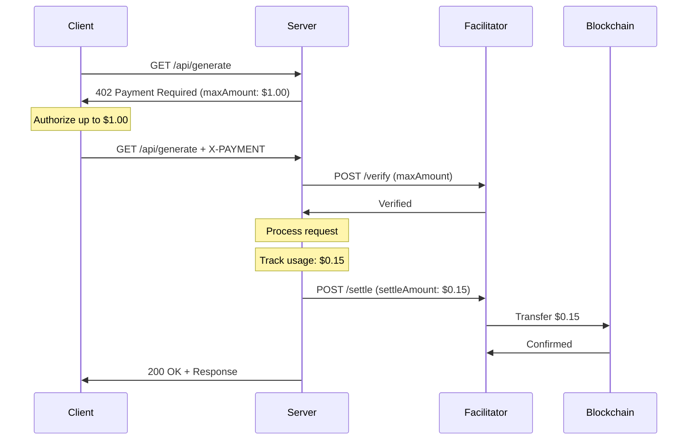

import { Callout, Tabs } from 'nextra/components'

# Up-To Scheme

The `upto` scheme enables **usage-based billing** by authorizing transfer of up to a maximum amount, with the actual settlement determined by usage.

## Overview

Unlike the `exact` scheme where the full amount is known upfront, `upto` allows clients to authorize a maximum payment while only being charged for what they actually use.



## Use Cases

- **LLM Token Generation**: Authorize $1.00, pay $0.15 for 1,500 tokens
- **Metered API Usage**: Pay per request or data volume
- **Streaming Services**: Pay per minute/second consumed
- **Compute Resources**: Pay per CPU/GPU second

## Payment Requirements

The server specifies maximum amount and optional billing configuration:

```json
{
  "scheme": "upto",
  "network": "eip155:8453",
  "maxAmount": "1000000",
  "minAmount": "10000",
  "asset": "0x833589fCD6eDb6E08f4c7C32D4f71b54bdA02913",
  "payTo": "0x...",
  "maxTimeoutSeconds": 300,
  "extra": {
    "unit": "token",
    "unitPrice": "100",
    "name": "USD Coin",
    "version": "2"
  }
}
```

### Fields

| Field | Type | Required | Description |
|-------|------|----------|-------------|
| `scheme` | string | Yes | Always `"upto"` |
| `network` | string | Yes | CAIP-2 network ID (e.g., `"eip155:8453"`) |
| `maxAmount` | string | Yes | Maximum authorized amount (smallest units) |
| `minAmount` | string | No | Minimum settlement amount (prevents dust) |
| `asset` | string | Yes | Token contract address |
| `payTo` | string | Yes | Recipient address |
| `maxTimeoutSeconds` | number | Yes | Authorization validity period |
| `extra.unit` | string | No | Billing unit (`"token"`, `"request"`, `"second"`, etc.) |
| `extra.unitPrice` | string | No | Price per unit |

### Supported Units

| Unit | Description | Example |
|------|-------------|---------|
| `token` | AI/LLM tokens | 1500 tokens @ $0.0001 |
| `request` | API requests | 100 requests @ $0.01 |
| `second` | Time-based | 60 seconds @ $0.001 |
| `minute` | Time-based | 5 minutes @ $0.05 |
| `byte` | Data volume | 1MB @ $0.001 |
| `kb` | Kilobytes | 1024 KB |
| `mb` | Megabytes | 10 MB |

## EVM Implementation

On EVM chains, the `upto` scheme uses **EIP-2612 Permit** for gasless authorization.

### Payment Payload

```json
{
  "t402Version": 2,
  "resource": {
    "url": "https://api.example.com/llm/generate",
    "description": "LLM token generation"
  },
  "accepted": {
    "scheme": "upto",
    "network": "eip155:8453",
    "maxAmount": "1000000",
    "asset": "0x833589fCD6eDb6E08f4c7C32D4f71b54bdA02913",
    "payTo": "0x...",
    "maxTimeoutSeconds": 300,
    "extra": {
      "name": "USD Coin",
      "version": "2",
      "routerAddress": "0x..."
    }
  },
  "payload": {
    "signature": {
      "v": 28,
      "r": "0x1234567890abcdef...",
      "s": "0xfedcba0987654321..."
    },
    "authorization": {
      "owner": "0x...",
      "spender": "0x...",
      "value": "1000000",
      "deadline": "1740675689",
      "nonce": 5
    },
    "paymentNonce": "0xf374..."
  }
}
```

### EIP-712 Domain

The permit signature uses EIP-712 typed data:

```typescript
const domain = {
  name: "USD Coin",      // Token name
  version: "2",          // Token version
  chainId: 8453,         // Chain ID
  verifyingContract: "0x833589fCD6eDb6E08f4c7C32D4f71b54bdA02913"
};

const types = {
  Permit: [
    { name: "owner", type: "address" },
    { name: "spender", type: "address" },
    { name: "value", type: "uint256" },
    { name: "nonce", type: "uint256" },
    { name: "deadline", type: "uint256" }
  ]
};
```

<Callout type="info">
The `name` and `version` fields in `extra` must match the token's EIP-712 domain. These vary by token - USDC uses `"USD Coin"` and `"2"`.
</Callout>

### Supported Tokens

| Token | EIP-2612 | Networks |
|-------|----------|----------|
| USDC | ✅ | Ethereum, Base, Arbitrum, Polygon |
| USDT | ❌ | Not supported (no permit) |
| DAI | ✅ | Ethereum, Base, Arbitrum |

<Callout type="warning">
USDT does not support EIP-2612 Permit. For USDT payments, use the `exact` scheme instead.
</Callout>

## Settlement

### Settlement Request

After processing the request, the server sends the actual usage amount:

```json
{
  "paymentPayload": "...",
  "paymentRequirements": {...},
  "settleAmount": "150000",
  "usageDetails": {
    "unitsConsumed": 1500,
    "unitPrice": "100",
    "unitType": "token",
    "startTime": 1740672000,
    "endTime": 1740675600
  }
}
```

### Settlement Rules

1. `settleAmount` **must be ≤** `maxAmount`
2. `settleAmount` **must be ≥** `minAmount` (if specified)
3. If `settleAmount` is 0, no transfer occurs (nonce still consumed)
4. Facilitator transfers exactly `settleAmount`, not `maxAmount`

### Settlement Response

```json
{
  "success": true,
  "transactionHash": "0x...",
  "settledAmount": "150000",
  "maxAmount": "1000000",
  "blockNumber": 12345678,
  "gasUsed": "85000"
}
```

## SDK Usage

<Tabs items={['TypeScript', 'Python', 'Go', 'Java']}>
<Tabs.Tab>
```typescript
import { UptoEvmScheme, UptoPaymentRequirements } from '@t402/evm';

// Client: Create payment
const scheme = UptoEvmScheme.client({
  signer: walletSigner,
  network: 'eip155:8453'
});

const payload = await scheme.createPaymentPayload(requirements);

// Server: Define requirements
const requirements: UptoPaymentRequirements = {
  scheme: 'upto',
  network: 'eip155:8453',
  maxAmount: '1000000',
  minAmount: '10000',
  asset: '0x833589fCD6eDb6E08f4c7C32D4f71b54bdA02913',
  payTo: '0x...',
  maxTimeoutSeconds: 300,
  extra: {
    unit: 'token',
    unitPrice: '100',
    name: 'USD Coin',
    version: '2'
  }
};

// Server: Settle with actual usage
const settlement = await facilitator.settle({
  payload,
  requirements,
  settleAmount: '150000',
  usageDetails: {
    unitsConsumed: 1500,
    unitPrice: '100',
    unitType: 'token'
  }
});
```
</Tabs.Tab>
<Tabs.Tab>
```python
from t402.schemes import (
    UptoEvmClientScheme,
    UptoPaymentRequirements,
    UptoExtra,
    create_upto_requirements,
    create_upto_settlement
)

# Client: Create payment
scheme = UptoEvmClientScheme(signer=wallet_signer)
payload = await scheme.create_payment_payload(requirements)

# Server: Define requirements
requirements = create_upto_requirements(
    network="eip155:8453",
    max_amount="1000000",
    asset="0x833589fCD6eDb6E08f4c7C32D4f71b54bdA02913",
    pay_to="0x...",
)
requirements.extra = UptoExtra(
    unit="token",
    unit_price="100",
    name="USD Coin",
    version="2"
)

# Server: Settle with actual usage
settlement = create_upto_settlement(
    settle_amount="150000",
    units_consumed=1500,
    unit_price="100",
    unit_type="token"
)
```
</Tabs.Tab>
<Tabs.Tab>
```go
import (
    "github.com/t402-io/t402/go/schemes/upto"
    evmupto "github.com/t402-io/t402/go/mechanisms/evm/upto"
)

// Server: Define requirements
requirements := upto.NewPaymentRequirements(
    "eip155:8453",
    "1000000",
    "0x833589fCD6eDb6E08f4c7C32D4f71b54bdA02913",
    "0x...",
)
requirements.Extra = upto.Extra{
    Unit:      "token",
    UnitPrice: "100",
    Name:      "USD Coin",
    Version:   "2",
}

// Server: Settle with actual usage
settlement := upto.NewSettlement("150000").
    WithUsageDetails(upto.NewUsageDetails(1500, "100", "token"))

// Verify payload is EIP-2612 format
if evmupto.IsEIP2612Payload(payloadData) {
    payload, _ := evmupto.PayloadFromMap(payloadData)
    // Process EIP-2612 permit
}
```
</Tabs.Tab>
<Tabs.Tab>
```java
import io.t402.schemes.upto.*;
import io.t402.schemes.evm.upto.*;

// Server: Define requirements
UptoPaymentRequirements requirements = UptoPaymentRequirements.builder()
    .network("eip155:8453")
    .maxAmount("1000000")
    .minAmount("10000")
    .asset("0x833589fCD6eDb6E08f4c7C32D4f71b54bdA02913")
    .payTo("0x...")
    .maxTimeoutSeconds(300)
    .extra(new UptoExtra("token", "100")
        .withName("USD Coin")
        .withVersion("2"))
    .build();

// Server: Settle with actual usage
UptoSettlement settlement = UptoSettlement.of("150000")
    .withUsageDetails(UptoUsageDetails.of(1500, "100", "token")
        .withTimeRange(1740672000L, 1740675600L));

// Verify payload is EIP-2612 format
if (UptoEvmTypes.isEIP2612Payload(payloadData)) {
    UptoEIP2612Payload payload = UptoEIP2612Payload.fromMap(payloadData);
    // Process EIP-2612 permit
}
```
</Tabs.Tab>
</Tabs>

## Security Considerations

### Client Protection

- Client **only authorizes maximum exposure** (`maxAmount`)
- Actual charge determined by server's settlement request
- Monitor settlement amounts vs. expected usage
- Set appropriate `maxAmount` limits

### Server Accountability

- **Accurately report usage** in settlement requests
- Settlement amounts should be **auditable**
- Log `usageDetails` for dispute resolution
- Provide transparent pricing (unit/unitPrice)

### Facilitator Role

- **Must not** settle more than authorized `maxAmount`
- **Must verify** settlement amount is within bounds
- Provides settlement receipts with details
- Maintains audit trail

## Partial Settlement

If a request is interrupted mid-processing:

1. Server calculates partial usage
2. Server settles for partial amount
3. Client receives partial response with settlement header

**Example**: Client authorizes $1.00, request generates 500 tokens before timeout, server settles for $0.05.

## Comparison with Exact Scheme

| Feature | `exact` | `upto` |
|---------|---------|--------|
| Amount field | `amount` | `maxAmount` |
| Settlement amount | Fixed | Variable (≤ max) |
| Client risk | Known exactly | Maximum exposure |
| Server complexity | Lower | Higher (usage tracking) |
| EVM implementation | EIP-3009 | EIP-2612 Permit |
| Best for | Fixed pricing | Usage-based billing |

## Troubleshooting

### Common Issues

**"Permit signature invalid"**
- Check that `name` and `version` match the token's EIP-712 domain
- Verify the deadline hasn't passed
- Ensure nonce matches client's current permit nonce

**"Settlement amount exceeds maximum"**
- `settleAmount` must be ≤ `maxAmount`
- Check for unit conversion errors

**"Token does not support permit"**
- Use a token with EIP-2612 support (USDC, DAI)
- For USDT, use `exact` scheme instead

### Debug Logging

Enable debug logs to trace the payment flow:

```typescript
// TypeScript
process.env.T402_DEBUG = 'true';
```

```python
# Python
import logging
logging.getLogger('t402').setLevel(logging.DEBUG)
```

## Further Reading

- [Payment Schemes Overview](/schemes)
- [EVM Reference](/reference/evm)
- [API Monetization Use Case](/use-cases/api-monetization)
- [AI Payments Use Case](/use-cases/ai-payments)
