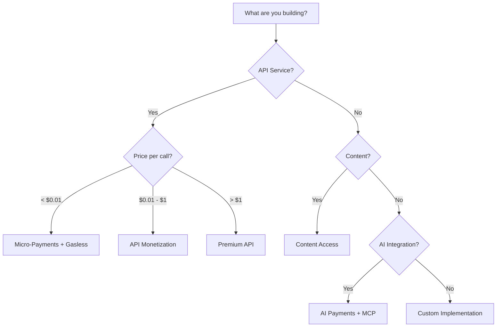

# Use Cases

T402 enables a wide variety of payment scenarios across web services, AI agents, and digital content. The protocol's HTTP-native design makes it simple to add payments to any application.

import { Cards, Card, Callout, Tabs } from 'nextra/components'

<Cards>
  <Card title="🤖 AI Agent Payments" href="/use-cases/ai-payments">
    Enable AI agents to pay for APIs autonomously. $0.001 - $0.10 per call.
  </Card>
  <Card title="🔌 API Monetization" href="/use-cases/api-monetization">
    Charge per-request fees for your API endpoints. $0.01 - $1.00 per request.
  </Card>
  <Card title="📰 Premium Content" href="/use-cases/content-access">
    Gate content behind micro-payments. $0.10 - $10.00 per item.
  </Card>
  <Card title="💸 Micro-Payments" href="/use-cases/micro-payments">
    Enable sub-cent payments for any resource. $0.0001 - $0.01 per tx.
  </Card>
</Cards>

## Quick Examples

<Tabs items={['AI Agent', 'API Server', 'Content Gate', 'Micro-Payment']}>
  <Tabs.Tab>
```typescript
// AI agent pays for API access via MCP
import { t402Client } from "@t402/fetch";

const client = new t402Client();
registerExactEvmScheme(client, { signer });

// Agent pays automatically when accessing paid APIs
const weather = await client.fetch("https://weather-api.com/forecast");
const analysis = await client.fetch("https://ai-analysis.com/process");
```
  </Tabs.Tab>
  <Tabs.Tab>
```typescript
// Monetize your API with one middleware
import { paymentMiddleware } from "@t402/express";

app.use(paymentMiddleware({
  "GET /api/data": {
    accepts: [{ scheme: "exact", price: "$0.01", network: "eip155:8453", payTo: "0x..." }],
  },
}));
```
  </Tabs.Tab>
  <Tabs.Tab>
```typescript
// Gate premium content
app.use(paymentMiddleware({
  "GET /articles/:id": {
    accepts: [{ scheme: "exact", price: "$0.25", network: "eip155:8453", payTo: "0x..." }],
    description: "Premium article access",
  },
}));
```
  </Tabs.Tab>
  <Tabs.Tab>
```typescript
// Enable micro-payments with gasless UX
import { createBundlerClient, createPaymaster } from "@t402/evm/erc4337";

const bundler = createBundlerClient({ provider: "pimlico", apiKey, chainId: 8453 });
const paymaster = createPaymaster({ provider: "pimlico", apiKey, chainId: 8453 });
// Users pay $0.001 without needing ETH for gas
```
  </Tabs.Tab>
</Tabs>

## Use Case Categories

| Use Case | Description | Typical Pricing |
|----------|-------------|-----------------|
| [AI Agent Payments](/use-cases/ai-payments) | Enable AI agents to pay for APIs and services autonomously | $0.001 - $0.10 per call |
| [API Monetization](/use-cases/api-monetization) | Charge per-request fees for your API endpoints | $0.01 - $1.00 per request |
| [Premium Content](/use-cases/content-access) | Gate content behind micro-payments | $0.10 - $10.00 per item |
| [Micro-Payments](/use-cases/micro-payments) | Enable sub-cent payments for any digital resource | $0.0001 - $0.01 per tx |

## AI Agent Payments

AI agents need a way to pay for services programmatically. T402 enables autonomous payments through:

- **MCP Integration**: Claude, GPT, and other AI agents can pay via the Model Context Protocol
- **No human intervention**: Agents sign and submit payments automatically
- **Budget controls**: Set spending limits and approval workflows

**Typical pricing:** $0.001 - $0.10 per API call

[Learn more about AI Payments →](/use-cases/ai-payments)

## API Monetization

Turn any API endpoint into a paid service with a single line of middleware:

- **Per-request pricing**: Charge exactly what each request is worth
- **No subscriptions needed**: Users pay only for what they use
- **Global payments**: Accept USDT/USDC from anywhere in the world

**Typical pricing:** $0.01 - $1.00 per request

[Learn more about API Monetization →](/use-cases/api-monetization)

## Premium Content Access

Gate articles, media, or downloadable content without subscription fatigue:

- **Micro-transactions**: Charge $0.10 for an article instead of $10/month
- **No account required**: Pay with any supported wallet
- **Instant access**: Content unlocks immediately after payment

**Typical pricing:** $0.10 - $10.00 per item

[Learn more about Content Access →](/use-cases/content-access)

## Micro-Payments

Enable payments as small as fractions of a cent for IoT, data, and compute:

- **Sub-cent transactions**: Pay $0.0001 for a single data point
- **Gasless payments**: ERC-4337 enables zero-gas transactions
- **High throughput**: Process thousands of payments per second

**Typical pricing:** $0.0001 - $0.01 per transaction

[Learn more about Micro-Payments →](/use-cases/micro-payments)

## Why T402?

| Traditional Payments | T402 |
|---------------------|------|
| Credit card fees (2.9% + $0.30) | Near-zero fees on L2s (~$0.001) |
| KYC/identity verification | Wallet-based, pseudonymous |
| Chargebacks possible | Irreversible settlements |
| Complex integration | Single HTTP header |
| Subscription-only models | Pay-per-use enabled |
| Days to receive funds | Instant settlement |

## Network Recommendations

| Use Case | Recommended Network | Why |
|----------|---------------------|-----|
| AI API calls | Base, Arbitrum | Low fees, fast finality |
| Premium APIs | Base, Ethereum | Wide wallet support |
| Content access | TON, TRON | Large user base in specific regions |
| Micro-payments | Base (gasless) | ERC-4337 for zero-gas UX |
| High-value transactions | Ethereum | Maximum security |
| Cross-chain | Any USDT0 chain | LayerZero bridging |

## Implementation Complexity

| Scenario | Effort | Description |
|----------|--------|-------------|
| Add payments to existing API | Low | Add middleware, configure routes |
| Build new paid service | Low | Use SDK from scratch |
| Gasless payments | Medium | Set up ERC-4337 infrastructure |
| Cross-chain support | Medium | Configure multiple networks |
| Custom facilitator | High | Deploy and operate facilitator |

## Get Started

1. **Choose your use case** from the table above
2. **Pick an SDK** ([TypeScript](/sdks/typescript), [Python](/sdks/python), [Go](/sdks/go), [Java](/sdks/java))
3. **Follow the quickstart** to add payments in minutes

[Quick Start Guide →](/getting-started/quickstart)

## Industry Applications

<Cards>
  <Card title="🧠 AI/ML Services">
    LLM inference, image generation, embeddings, fine-tuning APIs
  </Card>
  <Card title="📊 Data Providers">
    Market data, weather APIs, geolocation, analytics
  </Card>
  <Card title="🎮 Gaming">
    In-game purchases, NFT minting, tournament entries
  </Card>
  <Card title="📝 Publishing">
    Article access, research papers, premium newsletters
  </Card>
  <Card title="🔧 Developer Tools">
    CI/CD minutes, cloud functions, database queries
  </Card>
  <Card title="🎵 Media">
    Music streaming, video access, podcast premium episodes
  </Card>
</Cards>

### Real-World Examples

| Industry | Example | Pricing Model |
|----------|---------|---------------|
| **AI/ML** | GPT-4 API alternative | $0.002 per 1K tokens |
| **Data** | Real-time stock prices | $0.001 per quote |
| **IoT** | Sensor data marketplace | $0.0001 per reading |
| **Content** | Premium news articles | $0.25 per article |
| **Gaming** | Loot box purchases | $0.99 per box |
| **Dev Tools** | Serverless function calls | $0.00001 per invocation |

### Benefits by Industry

<Tabs items={['AI/ML', 'Data', 'Content']}>
  <Tabs.Tab>
**AI/ML Services**
- No API key management needed
- Pay-per-token or pay-per-request
- Budget controls for AI agents
- Multi-model marketplace enabled
- Cross-provider payments standardized
  </Tabs.Tab>
  <Tabs.Tab>
**Data Providers**
- Monetize APIs without subscriptions
- Real-time micro-payments for live data
- No minimum commitment from users
- Global reach without payment processors
- Instant settlement to your wallet
  </Tabs.Tab>
  <Tabs.Tab>
**Content Publishers**
- Alternative to subscription fatigue
- Readers pay only for what they read
- No account creation required
- Works with any wallet
- Higher conversion than paywalls
  </Tabs.Tab>
</Tabs>

## Choosing the Right Approach



## Resources

<Cards>
  <Card title="📖 Protocol Specification" href="/specs">
    Technical details of the t402 protocol
  </Card>
  <Card title="🔗 Supported Chains" href="/chains">
    Full list of supported blockchains
  </Card>
  <Card title="⚙️ Advanced Configuration" href="/advanced">
    MCP, extensions, and more
  </Card>
  <Card title="🚀 Quick Start" href="/getting-started/quickstart">
    Get started in 5 minutes
  </Card>
</Cards>
