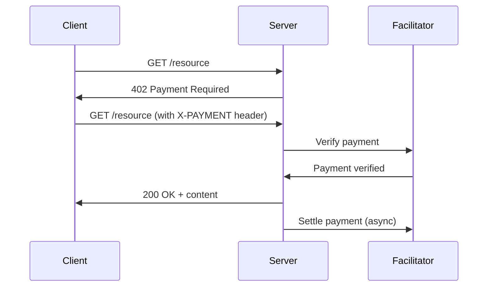

# t402 Java SDK

[](https://central.sonatype.com/artifact/io.t402/t402)
[](https://github.com/t402-io/t402/java)
[](https://github.com/t402-io/t402/blob/main/LICENSE)
[](https://github.com/t402-io/t402/java)

Java implementation of the [t402 Payment Protocol](https://t402.io).

## Installation

**Maven:**
```xml
<dependency>
    <groupId>io.t402</groupId>
    <artifactId>t402</artifactId>
    <version>1.1.0</version>
</dependency>
```

**Gradle:**
```groovy
implementation 'io.t402:t402:1.1.0'
```

## Features

### Multi-Chain Support
- **EVM**: EIP-3009 TransferWithAuthorization with Web3j
- **Solana (SVM)**: Ed25519 signing with Base58 encoding
- **TON**: Ed25519 signing with Base64 encoding
- **TRON**: ECDSA secp256k1 with Base58Check encoding

### ERC-4337 Account Abstraction
- UserOperation builder and submission
- Bundler client integration
- Paymaster support for gas sponsorship

### USDT0 Cross-Chain Bridge
- LayerZero OFT bridging
- Message tracking via LayerZero Scan
- Multi-chain USDT0 support

### WDK Integration
- BIP-39 seed phrase derivation
- Tether WDK compatible
- Multi-chain wallet support

### MCP Server
- Model Context Protocol server for AI agents
- Balance, payment, and bridge tools
- Demo mode for testing

### Additional Features
- **Spring Boot**: Auto-configuration for Spring Boot 3.x
- **Servlet Filter**: Jakarta Servlet filter for payment-protected endpoints
- **CLI Tool**: Command-line interface for verification and settlement

## Quick Start

### Spring Boot (Recommended)

Add configuration to `application.yml`:

```yaml
t402:
  enabled: true
  facilitator-url: https://facilitator.t402.io
  network: eip155:8453
  pay-to: "0xYourReceiverAddress"
  asset: "0x833589fCD6eDb6E08f4c7C32D4f71b54bdA02913"
  token-name: "USD Coin"
  token-version: "2"
```

Create a protected endpoint:

```java
@RestController
public class ApiController {

    @GetMapping("/api/premium")
    public Map<String, String> premiumContent() {
        return Map.of("data", "This content requires payment!");
    }
}
```

The `PaymentFilter` is automatically registered for `/api/*` endpoints.

### Manual Setup

```java
import io.t402.server.PaymentFilter;
import io.t402.client.HttpFacilitatorClient;

// Create facilitator client
FacilitatorClient facilitator = new HttpFacilitatorClient("https://facilitator.t402.io");

// Create and register the payment filter
PaymentFilter filter = new PaymentFilter(facilitator);

// Register with your servlet container
FilterRegistration.Dynamic registration = servletContext.addFilter("t402", filter);
registration.addMappingForUrlPatterns(EnumSet.of(DispatcherType.REQUEST), true, "/api/*");
```

## Client Usage

### EVM Payments with EvmSigner

```java
import io.t402.crypto.EvmSigner;
import io.t402.client.T402HttpClient;

// Create EVM signer for USDC on Base
EvmSigner signer = EvmSigner.fromPrivateKey(
    "0xYourPrivateKey",
    8453,                                              // Base chain ID
    "USD Coin",                                        // Token name
    "2",                                               // Token version
    "0x833589fCD6eDb6E08f4c7C32D4f71b54bdA02913"       // USDC address
);

// Create the client
T402HttpClient client = new T402HttpClient(signer);

// Make a payment request
BigInteger amount = BigInteger.valueOf(1_000_000); // 1 USDC (6 decimals)
HttpResponse<String> response = client.get(
    URI.create("https://api.example.com/premium"),
    amount,
    "0x833589fCD6eDb6E08f4c7C32D4f71b54bdA02913",
    "0xReceiverAddress"
);
```

### Signing EIP-3009 Authorization

```java
import io.t402.crypto.EvmSigner;
import org.web3j.crypto.Credentials;

// Create signer
Credentials credentials = Credentials.create("0xYourPrivateKey");
EvmSigner signer = new EvmSigner(
    credentials,
    8453,                                              // Chain ID
    "USD Coin",                                        // Token name
    "2",                                               // Version
    "0x833589fCD6eDb6E08f4c7C32D4f71b54bdA02913"       // Token address
);

// Create authorization payload
Map<String, Object> payload = new HashMap<>();
payload.put("from", signer.getAddress());
payload.put("to", "0xRecipientAddress");
payload.put("value", "1000000");                       // 1 USDC
payload.put("validAfter", "0");
payload.put("validBefore", String.valueOf(System.currentTimeMillis() / 1000 + 3600));
payload.put("nonce", "0x" + generateRandomNonce());

// Sign with EIP-712
String signature = signer.sign(payload);
```

## Supported Networks

### EVM Chains (EIP-155)

| Network | Chain ID | CAIP-2 Identifier |
|---------|----------|-------------------|
| Ethereum | 1 | `eip155:1` |
| Base | 8453 | `eip155:8453` |
| Arbitrum | 42161 | `eip155:42161` |
| Optimism | 10 | `eip155:10` |
| Polygon | 137 | `eip155:137` |
| BSC | 56 | `eip155:56` |
| Avalanche | 43114 | `eip155:43114` |
| Ink | 57073 | `eip155:57073` |

### Solana (SVM)

| Network | CAIP-2 Identifier |
|---------|-------------------|
| Mainnet | `solana:5eykt4UsFv8P8NJdTREpY1vzqKqZKvdp` |
| Devnet | `solana:EtWTRABZaYq6iMfeYKouRu166VU2xqa1` |

### TON

| Network | CAIP-2 Identifier |
|---------|-------------------|
| Mainnet | `ton:mainnet` |
| Testnet | `ton:testnet` |

### TRON

| Network | CAIP-2 Identifier |
|---------|-------------------|
| Mainnet | `tron:mainnet` |
| Nile | `tron:nile` |
| Shasta | `tron:shasta` |

## Payment Flow



## API Reference

### Core Classes

| Class | Description |
|-------|-------------|
| `T402HttpClient` | HTTP client with automatic payment header handling |
| `PaymentFilter` | Servlet filter for payment-protected endpoints |
| `FacilitatorClient` | Interface for facilitator communication |
| `HttpFacilitatorClient` | HTTP implementation of FacilitatorClient |

### Crypto Classes

| Class | Description |
|-------|-------------|
| `CryptoSigner` | Interface for signing payment payloads |
| `EvmSigner` | EIP-3009 signing for EVM chains |
| `SvmSigner` | Ed25519 signing for Solana |
| `TonSigner` | Ed25519 signing for TON |
| `TronSigner` | ECDSA secp256k1 signing for TRON |

### ERC-4337 Classes

| Class | Description |
|-------|-------------|
| `UserOperation` | ERC-4337 v0.7 UserOperation structure |
| `BundlerClient` | Bundler JSON-RPC client |
| `PaymasterClient` | Paymaster integration |
| `GasEstimate` | Gas estimation types |
| `PaymasterData` | Paymaster data encoding |

### Bridge Classes

| Class | Description |
|-------|-------------|
| `Usdt0Bridge` | LayerZero OFT bridge client |
| `LayerZeroScanClient` | Message tracking API |
| `BridgeConstants` | Chain endpoints and addresses |
| `BridgeSigner` | Interface for bridge transactions |

### WDK Classes

| Class | Description |
|-------|-------------|
| `WDKSigner` | BIP-39 seed phrase wallet |
| `WDKChains` | Chain configuration |
| `WDKTypes` | Configuration and balance types |

### MCP Classes

| Class | Description |
|-------|-------------|
| `McpServer` | Model Context Protocol server |
| `McpTools` | Tool handlers for payment operations |
| `McpTypes` | MCP type definitions |
| `McpConstants` | Network configuration and utilities |
| `T402Mcp` | CLI entry point for MCP server |

### Spring Boot

| Class | Description |
|-------|-------------|
| `T402AutoConfiguration` | Auto-configuration for Spring Boot |
| `T402Properties` | Configuration properties (`t402.*`) |

### Models

| Class | Description |
|-------|-------------|
| `PaymentPayload` | Payment header structure |
| `PaymentRequirements` | Payment requirements for an endpoint |
| `Authorization` | EIP-3009 authorization structure |
| `VerificationResponse` | Facilitator verification response |
| `SettlementResponse` | Facilitator settlement response |

## Configuration Properties

| Property | Description | Default |
|----------|-------------|---------|
| `t402.enabled` | Enable T402 integration | `false` |
| `t402.facilitator-url` | Facilitator service URL | `https://facilitator.t402.io` |
| `t402.network` | Network identifier (CAIP-2) | `eip155:8453` |
| `t402.pay-to` | Payment receiver address | - |
| `t402.asset` | Token contract address | - |
| `t402.token-name` | EIP-712 token name | `USD Coin` |
| `t402.token-version` | EIP-712 token version | `2` |
| `t402.scheme` | Payment scheme | `exact` |
| `t402.max-timeout-seconds` | Max payment timeout | `3600` |

## Development

```bash
# Build and test
mvn clean install

# Run tests with coverage
mvn test -Pcoverage

# Check code style
mvn checkstyle:check

# Run SpotBugs analysis
mvn spotbugs:check
```

## Error Handling

### Payment Required (402)

When payment is required but not provided:

```json
{
  "t402Version": 2,
  "accepts": [
    {
      "scheme": "exact",
      "network": "eip155:8453",
      "amount": "1000000",
      "asset": "0x833589fCD6eDb6E08f4c7C32D4f71b54bdA02913",
      "payTo": "0xReceiverAddress"
    }
  ],
  "error": "missing payment header"
}
```

### Verification Failed

```json
{
  "error": "Payment verification failed: invalid signature"
}
```

## License

Apache 2.0 - See [LICENSE](../LICENSE) for details.
