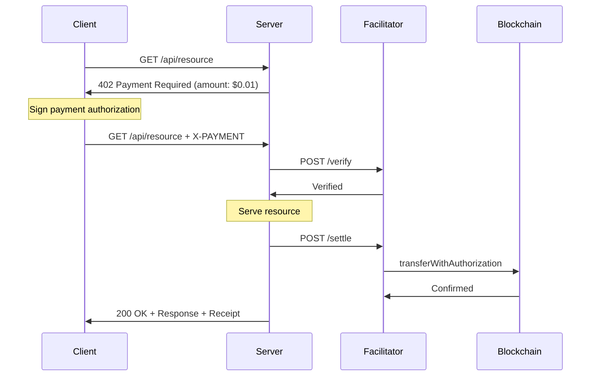

import { Callout, Tabs } from 'nextra/components'

# Exact Scheme

The `exact` scheme enables **fixed-amount payments** where the cost is known upfront. The client signs an authorization for a specific amount, and the facilitator executes the transfer on-chain.

## Overview

The `exact` scheme is the primary payment scheme in T402. The client pre-signs a payment authorization off-chain, which the facilitator later submits to the blockchain for settlement. The client never pays gas.



## Use Cases

- **API Monetization**: Fixed price per API call ($0.01/request)
- **Content Purchases**: One-time payment for articles, images, datasets
- **Subscription Tokens**: Pre-pay for access periods
- **Data Marketplace**: Fixed price per data record
- **IoT Micropayments**: Sensor readings at known cost

## Payment Requirements

The server specifies the exact amount required:

```json
{
  "scheme": "exact",
  "network": "eip155:8453",
  "amount": "10000",
  "asset": "0x833589fCD6eDb6E08f4c7C32D4f71b54bdA02913",
  "payTo": "0xMerchantAddress...",
  "maxTimeoutSeconds": 300,
  "extra": {
    "name": "USD Coin",
    "version": "2"
  }
}
```

### Fields

| Field | Type | Required | Description |
|-------|------|----------|-------------|
| `scheme` | string | Yes | Always `"exact"` |
| `network` | string | Yes | CAIP-2 network ID (e.g., `"eip155:8453"`) |
| `amount` | string | Yes | Exact payment amount (smallest units) |
| `asset` | string | Yes | Token contract address or identifier |
| `payTo` | string | Yes | Recipient address |
| `maxTimeoutSeconds` | number | Yes | Authorization validity period in seconds |
| `extra.name` | string | EVM only | Token EIP-712 domain name |
| `extra.version` | string | EVM only | Token EIP-712 domain version |
| `extra.feePayer` | string | SVM only | Facilitator address for fee coverage |

## EVM Implementation (EIP-3009)

On EVM chains, the `exact` scheme uses **EIP-3009 TransferWithAuthorization** — a gasless transfer standard where the token holder signs a transfer authorization off-chain and a relayer executes it.

### How It Works

1. **Client** signs an EIP-712 typed data message authorizing a specific transfer
2. **Facilitator** calls `transferWithAuthorization(from, to, value, validAfter, validBefore, nonce, v, r, s)` on the token contract
3. The token contract verifies the signature and executes the transfer
4. Client pays **zero gas** — the facilitator covers transaction costs

### EIP-712 Typed Data

```typescript
const domain = {
  name: "USD Coin",     // Token name (from extra.name)
  version: "2",         // Token version (from extra.version)
  chainId: 8453,        // From network ID
  verifyingContract: "0x833589fCD6eDb6E08f4c7C32D4f71b54bdA02913"
};

const types = {
  TransferWithAuthorization: [
    { name: "from", type: "address" },
    { name: "to", type: "address" },
    { name: "value", type: "uint256" },
    { name: "validAfter", type: "uint256" },
    { name: "validBefore", type: "uint256" },
    { name: "nonce", type: "bytes32" }
  ]
};

const message = {
  from: "0xClientAddress...",
  to: "0xMerchantAddress...",
  value: "10000",                    // Exact amount
  validAfter: "1700000000",          // Current time - 600s
  validBefore: "1700000300",         // Current time + maxTimeoutSeconds
  nonce: "0x1234567890abcdef..."     // Random 32-byte nonce
};
```

### Payment Payload

```json
{
  "t402Version": 2,
  "accepted": {
    "scheme": "exact",
    "network": "eip155:8453",
    "amount": "10000",
    "asset": "0x833589fCD6eDb6E08f4c7C32D4f71b54bdA02913",
    "payTo": "0xMerchantAddress..."
  },
  "payload": {
    "signature": "0xabcdef1234...",
    "authorization": {
      "from": "0xClientAddress...",
      "to": "0xMerchantAddress...",
      "value": "10000",
      "validAfter": "1700000000",
      "validBefore": "1700000300",
      "nonce": "0x1234567890abcdef..."
    }
  }
}
```

### Supported EVM Tokens

| Token | EIP-3009 | Networks |
|-------|----------|----------|
| USDT0 | ✅ | Ethereum, Arbitrum, Ink, Berachain, Unichain |
| USDC | ✅ | Ethereum, Base, Arbitrum, Optimism |

<Callout type="info">
  EIP-3009 is supported by USDT0 (LayerZero OFT) and USDC. Both support gasless `transferWithAuthorization`.
  The `extra.name` and `extra.version` fields must match the token's EIP-712 domain exactly.
</Callout>

### Smart Wallet Support (EIP-6492)

The exact scheme supports smart contract wallets (Safe, ERC-4337 accounts) via EIP-6492 signature validation:

```typescript
// Smart wallet signatures use EIP-6492 wrapper
// The facilitator automatically detects and validates:
// 1. Standard EOA signatures (ECDSA)
// 2. EIP-1271 smart contract signatures (deployed wallets)
// 3. EIP-6492 signatures (undeployed counterfactual wallets)
```

<Callout type="warning">
  For undeployed smart wallets, the facilitator must deploy the wallet before executing
  `transferWithAuthorization`. Set `deployERC4337WithEIP6492: true` in facilitator config.
</Callout>

## Non-EVM Implementations

Non-EVM chains use the **exact-direct** variant where the client executes the transfer directly on-chain and provides the transaction hash as proof.

### Exact vs Exact-Direct

| Aspect | `exact` (EVM) | `exact-direct` (Non-EVM) |
|--------|---------------|--------------------------|
| Who executes transfer | Facilitator | Client |
| Client pays gas | No | Yes |
| Authorization method | Off-chain signature | On-chain transaction |
| Proof | Signed EIP-712 message | Transaction hash |
| Settlement | Facilitator calls contract | Already settled |
| Facilitator role | Execute + verify | Verify only |

### Solana (SPL Token Transfer)

```json
{
  "scheme": "exact",
  "network": "solana:5eykt4UsFv8P8NJdTREpY1vzqKqZKvdp",
  "amount": "10000",
  "asset": "EPjFWdd5AufqSSqeM2qN1xzybapC8G4wEGGkZwyTDt1v",
  "payTo": "FacilitatorPublicKey...",
  "extra": {
    "feePayer": "FacilitatorPublicKey..."
  }
}
```

The client creates a partially-signed `TransferChecked` instruction. The facilitator adds its signature (as fee payer) and submits.

### TON (Jetton Transfer)

```json
{
  "scheme": "exact",
  "network": "ton:mainnet",
  "amount": "10000",
  "asset": "EQCxE6mUtQJKFnGfaROTKOt1lZbDiiX1kCixRv7Nw2Id_sDs",
  "payTo": "EQRecipientAddress...",
  "maxTimeoutSeconds": 300
}
```

The client signs an external message containing a Jetton transfer operation. The facilitator submits the signed BOC to the TON network.

### TRON (TRC-20 Transfer)

```json
{
  "scheme": "exact",
  "network": "tron:mainnet",
  "amount": "10000",
  "asset": "TR7NHqjeKQxGTCi8q8ZY4pL8otSzgjLj6t",
  "payTo": "TRecipientAddress...",
  "maxTimeoutSeconds": 300
}
```

The client signs a TRC-20 transfer transaction with reference block bytes for replay protection.

### NEAR, Aptos, Tezos, Polkadot, Stacks, Cosmos (Direct Transfer)

These chains use `exact-direct` — the client executes the transfer and returns the transaction hash:

```json
{
  "payload": {
    "txHash": "abc123...",
    "from": "sender-address",
    "to": "recipient-address",
    "amount": "10000"
  }
}
```

See individual chain reference pages for details:
- [NEAR](/reference/near) — NEP-141 `ft_transfer`
- [Aptos](/reference/aptos) — Fungible Asset `primary_fungible_store::transfer`
- [Tezos](/reference/tezos) — FA2 `transfer` entrypoint
- [Polkadot](/reference/polkadot) — `assets.transfer` extrinsic
- [Stacks](/reference/stacks) — SIP-010 `transfer` contract call
- [Cosmos](/reference/cosmos) — Bank `MsgSend`

## Verification

The facilitator performs these checks before approving a payment:

| Check | Description |
|-------|-------------|
| Payload structure | All required fields present and correctly typed |
| Scheme match | `scheme` equals `"exact"` |
| Network match | Payload network matches requirements |
| Signature validity | EIP-712 signature recovers to `from` address |
| Recipient match | `to` matches `payTo` in requirements |
| Time window | `validAfter ≤ now` and `validBefore > now` |
| Balance check | Client has sufficient token balance |
| Amount check | `value ≥ amount` in requirements |

### Error Codes

| Code | Description | Recovery |
|------|-------------|----------|
| `invalid_payload_structure` | Missing or malformed fields | Check payload format |
| `unsupported_scheme` | Scheme is not `"exact"` | Use correct scheme |
| `network_mismatch` | Network doesn't match | Use correct network |
| `invalid_exact_evm_payload_signature` | Signature verification failed | Re-sign with correct key |
| `invalid_exact_evm_payload_recipient_mismatch` | `to` doesn't match `payTo` | Use address from requirements |
| `invalid_exact_evm_payload_authorization_valid_before` | Authorization expired | Create new authorization |
| `invalid_exact_evm_payload_authorization_valid_after` | Not yet valid | Wait or adjust validAfter |
| `insufficient_funds` | Token balance too low | Fund the wallet |
| `invalid_exact_evm_payload_authorization_value` | Amount too low | Use amount from requirements |

## SDK Usage

<Tabs items={['TypeScript', 'Python', 'Go', 'Java']}>
<Tabs.Tab>
```typescript
import { t402Client } from '@t402/fetch'
import { ExactEvmScheme } from '@t402/evm/exact/client'
import { privateKeyToAccount } from 'viem/accounts'

// Client: Register scheme and make payment
const client = new t402Client()
const account = privateKeyToAccount('0x...')

client.register('eip155:*', new ExactEvmScheme(account))

// Automatic 402 handling
const fetchWithPay = wrapFetchWithPayment(fetch, client)
const response = await fetchWithPay('https://api.example.com/data')
```

```typescript
// Server: Define requirements
import { paymentMiddleware } from '@t402/express'
import { ExactEvmScheme } from '@t402/evm/exact/server'

app.use(paymentMiddleware({
  'GET /api/data': {
    accepts: [{
      scheme: 'exact',
      network: 'eip155:8453',
      price: '$0.01',
      payTo: '0xMerchantAddress...'
    }],
    description: 'Premium API data'
  }
}, server))
```

```typescript
// Facilitator: Verify and settle
import { ExactEvmScheme } from '@t402/evm/exact/facilitator'

const facilitator = new ExactEvmScheme(facilitatorSigner)

const verifyResult = await facilitator.verify(payload, requirements)
// { isValid: true, payer: "0x...", network: "eip155:8453" }

const settleResult = await facilitator.settle(payload, requirements)
// { success: true, transaction: "0xabc...", blockNumber: 12345 }
```
</Tabs.Tab>
<Tabs.Tab>
```python
from t402.schemes import ExactEvmClientScheme
from t402 import T402Client

# Client: Create payment
scheme = ExactEvmClientScheme(signer=wallet_signer)
client = T402Client()
client.register("eip155:*", scheme)

# Make request with automatic payment
response = await client.fetch("https://api.example.com/data")
```

```python
# Server: Define requirements
from t402.server import payment_required

@payment_required(
    scheme="exact",
    network="eip155:8453",
    price="$0.01",
    pay_to="0xMerchantAddress..."
)
async def get_data(request):
    return {"data": "premium content"}
```
</Tabs.Tab>
<Tabs.Tab>
```go
import (
    "github.com/t402-io/t402/sdks/go/mechanisms/evm/exact"
)

// Client
client := exact.NewExactEvmScheme(signer)
payload, err := client.CreatePaymentPayload(ctx, requirements)

// Server
server := exact.NewExactEvmServer(&exact.Config{})
enhanced, err := server.EnhancePaymentRequirements(ctx, base, kind, extensions)

// Facilitator
facilitator := exact.NewExactEvmFacilitator(facilitatorSigner, &exact.Config{})
result, err := facilitator.Verify(ctx, payload, requirements)
settled, err := facilitator.Settle(ctx, payload, requirements)
```
</Tabs.Tab>
<Tabs.Tab>
```java
import io.t402.model.ExactSchemePayload;
import io.t402.client.T402Client;

// Client: Create payment
T402Client client = T402Client.builder()
    .signer(walletSigner)
    .network("eip155:8453")
    .build();

ExactSchemePayload payload = client.createPaymentPayload(requirements);

// Server: Spring Boot integration
@T402Protected(
    scheme = "exact",
    network = "eip155:8453",
    price = "$0.01",
    payTo = "0xMerchantAddress..."
)
@GetMapping("/api/data")
public ResponseEntity<?> getData() {
    return ResponseEntity.ok(Map.of("data", "premium"));
}
```
</Tabs.Tab>
</Tabs>

## Security Considerations

### Replay Protection

| Chain | Mechanism |
|-------|-----------|
| EVM | Random 32-byte nonce (unique per authorization) |
| Solana | Recent blockhash (expires after ~2 minutes) |
| TON | Wallet seqno + query ID |
| TRON | Reference block bytes/hash + expiration |
| NEAR/Aptos/Tezos/Polkadot/Stacks/Cosmos | Transaction hash uniqueness |

### Time Window

The `validAfter` and `validBefore` fields create a bounded time window:

```
validAfter = now - 600s    (10 minute grace for clock skew)
validBefore = now + maxTimeoutSeconds
```

<Callout type="warning">
  Set `maxTimeoutSeconds` appropriately for your use case. Too short may cause legitimate payments
  to expire. Too long increases the window for potential issues. 300 seconds (5 minutes) is recommended
  for most API calls.
</Callout>

### Amount Validation

- The facilitator verifies `value ≥ amount` (not exact equality)
- This allows clients to slightly overpay without rejection
- Settlement always transfers the exact `value` specified in the authorization

## Comparison with Up-To Scheme

| Feature | `exact` | `upto` |
|---------|---------|--------|
| Amount field | `amount` | `maxAmount` |
| Settlement amount | Fixed (equals `value`) | Variable (≤ `maxAmount`) |
| Client risk | Known exactly | Maximum exposure known |
| Server complexity | Lower | Higher (usage tracking) |
| EVM signature | EIP-3009 TransferWithAuthorization | EIP-2612 Permit |
| Token support | USDT0, USDC | USDC, DAI (not USDT) |
| Best for | Fixed pricing | Usage-based billing |

## Network Support

| Network | Scheme Variant | Signature | Token Standard |
|---------|---------------|-----------|----------------|
| EVM (25 chains) | `exact` | EIP-712 | EIP-3009 |
| Solana | `exact` | Ed25519 | SPL TransferChecked |
| TON | `exact` | Ed25519 | Jetton transfer |
| TRON | `exact` | secp256k1 | TRC-20 transfer |
| NEAR | `exact-direct` | Ed25519 | NEP-141 ft_transfer |
| Aptos | `exact-direct` | Ed25519 | FA transfer |
| Tezos | `exact-direct` | Ed25519/secp256k1 | FA2 transfer |
| Polkadot | `exact-direct` | Sr25519 | assets.transfer |
| Stacks | `exact-direct` | secp256k1 | SIP-010 transfer |
| Cosmos (Noble) | `exact-direct` | secp256k1 | Bank MsgSend |

## Troubleshooting

### Common Issues

**"Signature verification failed"**
- Ensure `extra.name` and `extra.version` match the token's EIP-712 domain
- USDT0 uses `name: "USDT0"`, `version: "1"`
- USDC uses `name: "USD Coin"`, `version: "2"`

**"Authorization expired"**
- `validBefore` has passed — create a new payment payload
- Check server/client clock synchronization

**"Insufficient funds"**
- Client wallet needs sufficient token balance
- Balance is checked at verification time, not signing time

**"Recipient mismatch"**
- The `to` in authorization must exactly match `payTo` in requirements
- Check for address checksum differences

**"Nonce already used"**
- Each nonce can only be used once per (from, token) pair
- The SDK generates random 32-byte nonces to avoid collisions

## Further Reading

- [Payment Schemes Overview](/schemes)
- [Up-To Scheme](/schemes/upto) — Variable-amount alternative
- [EVM Reference](/reference/evm) — Full EVM mechanism API
- [Supported Chains](/chains) — All supported networks
- [API Monetization](/use-cases/api-monetization) — Use case guide
