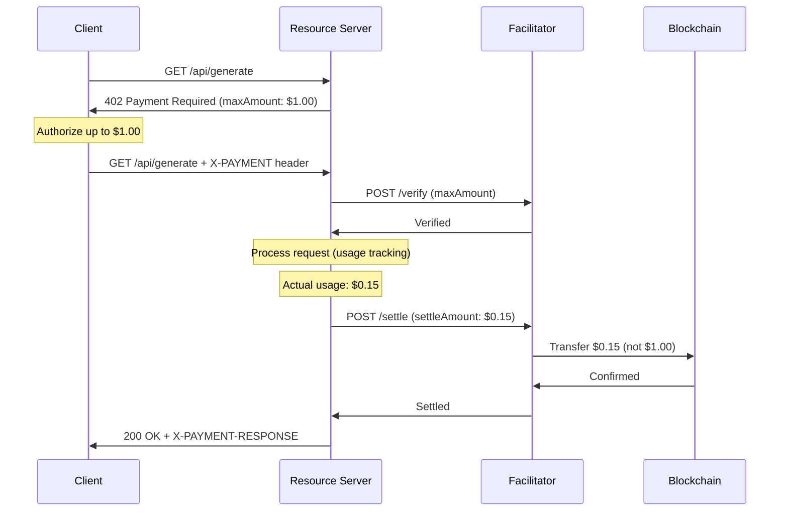

# Scheme: `upto`

## Summary

`upto` is a scheme that authorizes transfer of **up to** a specified maximum amount of funds from a client to a resource server. Unlike `exact`, the final settlement amount is determined by actual usage, making it suitable for metered/usage-based billing scenarios.

## Example Use Cases

- **LLM Token Generation**: Pay per token generated (e.g., authorize up to $1, settle for $0.15 based on actual tokens)
- **API Metered Usage**: Pay per request or data volume
- **Streaming Services**: Pay per minute/second of content consumed
- **Compute Resources**: Pay per CPU/GPU second used

## Protocol Flow



## PaymentRequirements

The `upto` scheme requires these additional fields in `PaymentRequirements`:

| Field | Type | Required | Description |
|-------|------|----------|-------------|
| `maxAmount` | string | Yes | Maximum amount the client authorizes |
| `minAmount` | string | No | Minimum amount (prevents dust payments) |
| `unit` | string | No | Billing unit (e.g., "token", "request", "second") |
| `unitPrice` | string | No | Price per unit in smallest denomination |

Example:

```json
{
  "scheme": "upto",
  "network": "eip155:8453",
  "maxAmount": "1000000",
  "minAmount": "10000",
  "asset": "0x833589fCD6eDb6E08f4c7C32D4f71b54bdA02913",
  "payTo": "0x...",
  "maxTimeoutSeconds": 300,
  "extra": {
    "unit": "token",
    "unitPrice": "100"
  }
}
```

## PaymentPayload

The `payload` field must contain:

- `signature`: Authorization signature (format varies by network)
- `authorization`: Authorization parameters including `maxAmount`
- `nonce`: Unique payment identifier

Example:

```json
{
  "t402Version": 2,
  "resource": {
    "url": "https://api.example.com/llm/generate",
    "description": "LLM token generation",
    "mimeType": "text/event-stream"
  },
  "accepted": {
    "scheme": "upto",
    "network": "eip155:8453",
    "maxAmount": "1000000",
    "asset": "0x833589fCD6eDb6E08f4c7C32D4f71b54bdA02913",
    "payTo": "0x...",
    "maxTimeoutSeconds": 300,
    "extra": {}
  },
  "payload": {
    "signature": "0x...",
    "authorization": {
      "from": "0x...",
      "to": "0x...",
      "maxValue": "1000000",
      "validAfter": "1740672089",
      "validBefore": "1740675689",
      "nonce": "0x..."
    }
  }
}
```

## Verification

Facilitator MUST verify:

1. Signature is valid for the authorization parameters
2. Client has sufficient balance for `maxAmount`
3. `maxAmount` meets any `minAmount` requirement
4. Authorization is within valid time range
5. Nonce has not been used
6. Authorization is for the correct asset and chain

## Settlement

### Settlement Request

Resource server specifies actual settlement amount:

```json
{
  "paymentPayload": "...",
  "paymentRequirements": {...},
  "settleAmount": "150000",
  "usageDetails": {
    "tokensGenerated": 1500,
    "unitPrice": "100"
  }
}
```

### Settlement Rules

1. `settleAmount` MUST be ≤ `maxAmount`
2. `settleAmount` MUST be ≥ `minAmount` (if specified)
3. If `settleAmount` is 0, no transfer occurs (but nonce is still consumed)
4. Facilitator transfers exactly `settleAmount`, not `maxAmount`

## Security Considerations

### Client Protection

- Client only authorizes maximum exposure (`maxAmount`)
- Actual charge is determined by server's settlement request
- Clients should monitor settlement amounts vs. expected usage

### Server Accountability

- Servers MUST accurately report usage
- Settlement amounts should be auditable
- Consider logging `usageDetails` for dispute resolution

### Facilitator Role

- MUST NOT settle more than authorized `maxAmount`
- MUST verify settlement amount is within bounds
- SHOULD provide settlement receipts with usage details

## Partial Settlement

If a request is interrupted mid-processing:

1. Server calculates partial usage
2. Server settles for partial amount
3. Client receives partial response with settlement header

Example: Client authorizes $1.00, request generates 500 tokens before timeout, server settles for $0.05.

## Appendix

### Comparison with `exact`

| Feature | `exact` | `upto` |
|---------|---------|--------|
| Amount known upfront | Yes | Maximum only |
| Settlement amount | Fixed | Variable (≤ max) |
| Use case | Fixed pricing | Usage-based |
| Complexity | Lower | Higher |

### Network Support

| Network | Implementation | Status |
|---------|---------------|--------|
| EVM | EIP-2612 + Router Contract | Planned |
| Solana | SPL Token Approve + Transfer | Planned |
| TON | Jetton Approve Pattern | Planned |

See network-specific documents for implementation details.
